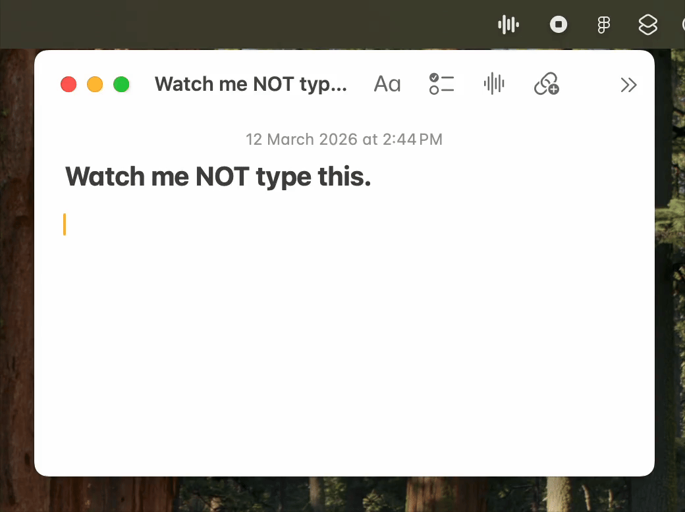

# Not Wispr Flow


Free, offline voice-to-text for **macOS**. Hold a key, speak, release — your words appear wherever your cursor is. Runs as a menu bar app, works system-wide in any app.

Everything runs on your machine by default. No cloud, no subscription, no data leaving your computer. Uses OpenAI's Whisper model through Apple's MLX framework, running on your Mac's GPU.

Optionally, add API keys for faster cloud transcription (Groq) and AI text enhancement (Groq Llama, Gemini, OpenAI, or Anthropic) — falls back to offline automatically if your internet drops.

**You'll need:** Mac with Apple Silicon (M1/M2/M3/M4) • If running offline: ~1-3GB RAM depending on your model choice.



## About this project

Inspired by [Wispr Flow](https://wisprflow.ai/). They've built something genuinely impressive — this project doesn't come close to their quality and features.

But this gets the job done for free and runs entirely on your machine (if privacy is what you need). The tradeoff? It'll use some of your RAM (~2-3GB) since the AI model stays in memory while running.

## Installation (Option 1: MacOS app)

### 1. Download

Click the green **Code** button above → **Download ZIP**. Unzip it wherever you like.

### 2. Install

In Finder, right-click the downloaded `not-wispr-flow` folder → **New Terminal at Folder**

Then paste:
```bash
./install.sh
```

That's it. The script handles everything: installs Python if needed, downloads packages, creates a signing certificate, builds the app, and installs it to Applications.

**It will ask for your Mac password once** — this creates a local code-signing certificate so macOS remembers your permissions across updates. Everything stays on your Mac, nothing is sent anywhere.

Takes about 5-10 minutes on first run. Re-runs are faster (skips steps already done).

### 3. Launch

Open **"Not Wispr Flow"** from Applications or Spotlight (Cmd+Space).

### 4. Grant permissions (first time only)

System Settings → Privacy & Security → give **"Not Wispr Flow"** access to:
- Microphone
- Accessibility
- Input Monitoring

Permissions persist across updates — you only need to do this once.

## Alternative: Run in Terminal (Option 2)

If you just want to try it out without installing the app, you can run it directly. You'll need Python 3.10+ installed.

In Finder, right-click the downloaded `not-wispr-flow` folder → **New Terminal at Folder**

```bash
python3 -m venv venv
source venv/bin/activate
pip install -r requirements.txt
python3 main.py
```

Keep Terminal open while using it. Press `Ctrl+C` to stop. Permissions go to **Terminal** instead of the app.

## Uninstall

```bash
./uninstall.sh
```

---

## How to use it

You'll see a menu bar icon at the top of your screen when it's running.

**Recording modes:**
* **Hold mode:** Hold Control → speak → release
* **Toggle mode:** Press Control + Space → speak → press Control again

**Other shortcuts:**
* **Retype last:** Press Ctrl+Cmd+C to retype the last transcription (also available from the menu bar)

**First time:** Downloads the AI model (~1-3GB). Takes a few minutes, only happens once.

**Media pause/resume:** If you're listening to music or podcasts, the app automatically pauses playback when you start recording and resumes when transcription is done.

---

## API Keys (Optional)

Out of the box, everything runs offline on your Mac. API keys unlock faster transcription and AI text enhancement.

### Supported Providers

| Provider | Used for | Free tier | Get a key |
|----------|----------|-----------|-----------|
| **Groq** | Cloud transcription (Whisper) + LLM cleanup (Llama) | Yes (generous) | [console.groq.com](https://console.groq.com) |
| **Gemini** | LLM text cleanup | Yes (generous) | [aistudio.google.com/app/apikey](https://aistudio.google.com/app/apikey) |
| **OpenAI** | LLM text cleanup (GPT-4o) | No (paid) | [platform.openai.com/api-keys](https://platform.openai.com/api-keys) |
| **Anthropic** | LLM text cleanup (Claude) | No (paid) | [console.anthropic.com/settings/keys](https://console.anthropic.com/settings/keys) |

**Groq is the main key** — It gives you faster online transcription. For LLM post-processing you have all the other options. You can select the LLM model you wanna use from the menubar, or add your own options in [config.py](notwisprflow/config.py). 

### Adding an API Key

**Option A — Paste in config.py** (quick and simple, good for personal use)

Open [config.py](notwisprflow/config.py), find the relevant `*_API_KEY` line, paste your key there.

Then repeat the installation step, re-install using `./install.sh` in Terminal.

**Option B — Save to a file** (safer if you plan to share your code)

1. Open Terminal and run: `mkdir -p ~/.config/notwisprflow`
2. Then run **one** of these (paste your real key between the quotes):
   - **Groq:** `echo "YOUR-KEY-HERE" > ~/.config/notwisprflow/api_key`
   - **Gemini:** `echo "YOUR-KEY-HERE" > ~/.config/notwisprflow/gemini_api_key`
   - **OpenAI:** `echo "YOUR-KEY-HERE" > ~/.config/notwisprflow/openai_api_key`
   - **Anthropic:** `echo "YOUR-KEY-HERE" > ~/.config/notwisprflow/anthropic_api_key`
3. Restart the app. (no need to re-install)

**Don't want online transcription at all?** Set `TRANSCRIPTION_MODE = "offline"` in [config.py](notwisprflow/config.py).

LLM text cleanup only runs when using online transcription (Groq). It's automatically skipped during offline/local transcription.

---

## Menu Bar

The menu bar icon shows the app state: idle, recording, or processing.

| Menu Item | What it does |
|-----------|-------------|
| **Retype last transcript** | Types the last transcription again (Ctrl+Cmd+C) |
| **Paste Mode** | Toggle between clipboard paste (default) and character-by-character typing |
| **LLM Model** | Switch between LLM models — only shows providers with a valid API key |
| **Personal Prompt...** | Edit personal prompt — additional instructions for the LLM |
| **Open Logs** | Opens the log file in your default text editor |
| **Quit** | Stops the app (Cmd+Q) |

---

## Customization

Want to change things up? Edit [config.py](notwisprflow/config.py) in any text editor:

**Whisper models:**
- `whisper-large-v3` (default in online mode) — Most accurate
- `whisper-large-v3-turbo` (default in offline mode) — Fast, accurate, ~2GB RAM
- `whisper-small` — Faster, less accurate, ~1GB RAM
- `whisper-base` — Fastest, least accurate, ~500MB RAM

**Hotkeys:**
- Control key (default) — `{Key.ctrl, Key.ctrl_r}`
- Command key — `{Key.cmd, Key.cmd_r}`
- Option key — `{Key.alt, Key.alt_r}`
- Or F13, etc.

**LLM models** (in `LLM_MODELS` dict — menu bar only shows models with a valid API key):

| Model | Provider | API Key |
|-------|----------|---------|
| `gemini-2.5-flash` | Gemini (Fast) | Gemini |
| `gemini-2.5-pro` | Gemini (Best) | Gemini |
| `llama-3.3-70b-versatile` | Groq Llama (Best) | Groq |
| `llama-3.1-8b-instant` | Groq Llama (Fastest) | Groq |
| `gpt-4o-mini` | OpenAI (Fast) | OpenAI |
| `gpt-4o` | OpenAI (Best) | OpenAI |
| `claude-haiku-4-5-20251001` | Anthropic (Fast) | Anthropic |
| `claude-sonnet-4-5-20250929` | Anthropic (Best) | Anthropic |
| `disabled` | None | — |

**After making changes:**
- If you installed as an app: Run `./install.sh` to rebuild
- If running in Terminal: Just restart it (`Ctrl+C` then `python3 main.py`)

---

## Troubleshooting

| Problem | Fix |
|---------|-----|
| Hotkey won't work | Check all 3 permissions are enabled (Microphone, Accessibility, Input Monitoring) |
| No text appears | Make sure Accessibility permission is on |
| Text is wrong/gibberish | Try talking louder, or switch to larger model in [config.py](notwisprflow/config.py) |
| Stopped working after rebuild | Run `./scripts/create_certificate.sh` first, then rebuild |
| Need logs? | `~/Library/Logs/NotWisprFlow/notwisprflow.log` (Cmd+Shift+G in Finder) |
| LLM not running? | Make sure you have the right API key set up and `TRANSCRIPTION_MODE` is not `"offline"` |

---

Inspired by [Wispr Flow](https://wisprflow.ai) • Uses [OpenAI Whisper](https://github.com/openai/whisper) via [mlx-whisper](https://github.com/ml-explore/mlx-examples/tree/main/whisper)
